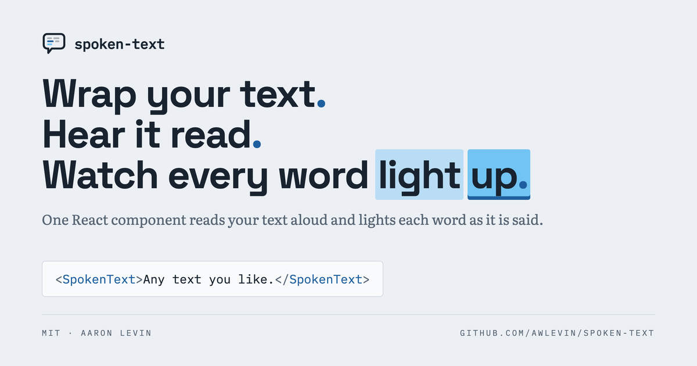
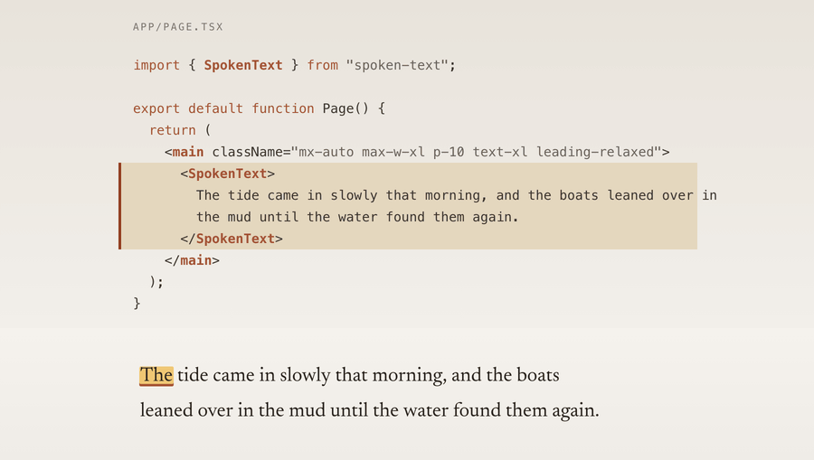

# TalkSync

_Wrap your text in one component, hear it read aloud, and watch each word light up as it is spoken._



Live at [talksync-six.vercel.app](https://talksync-six.vercel.app).

## Usage

```tsx
import { SpokenText } from "@/spoken-text";

<SpokenText>Any text you like.</SpokenText>;
```

That is the whole thing. `SpokenText` sends the text to `/api/transcription`,
gets back an MP3 and word-level timestamps, and highlights each word at the
moment it is spoken. Click any word to hear the passage from there.
`src/app/example/page.tsx` is that snippet as a page you can actually load.

If you want a play button and a scrubber, hold the controller yourself and put
a `Transport` next to it:

```tsx
import { SpokenText, Transport, useSpokenText } from "@/spoken-text";

function Reader({ text }: { text: string }) {
  const speech = useSpokenText(text);
  return (
    <>
      <SpokenText speech={speech} />
      <Transport speech={speech} />
    </>
  );
}
```

`useSpokenText` on its own is headless — it owns the audio and reports which
word is being spoken, so you can build whatever UI you like on top of it.

### `<SpokenText>`

| Prop               | Type                                                  | Default                | What it does                                                                             |
| ------------------ | ----------------------------------------------------- | ---------------------- | ---------------------------------------------------------------------------------------- |
| `children`         | `string`                                              | —                      | The passage to speak. Required unless you pass `speech`.                                   |
| `speech`           | `SpokenTextController`                                | —                      | A controller from `useSpokenText`, to share one passage with a `Transport`.                |
| `as`               | `"p" \| "div" \| "span" \| …`                          | `"p"`                  | Element the passage renders into.                                                          |
| `className`        | `string`                                              | —                      | Class on that element.                                                                     |
| `classNames`       | `{ word, past, current, future }`                     | —                      | Per-word classes. Setting one drops the built-in look for that slot, so your CSS wins.     |
| `renderWord`       | `(word: DisplayWord) => ReactNode`                    | —                      | Render words yourself. Whitespace is still inserted for you.                               |
| `seekOnWordClick`  | `boolean`                                             | `true`                 | Click a word to play from there.                                                           |
| `endpoint`         | `string`                                              | `"/api/transcription"` | Route that turns text into audio and timings.                                              |
| `fetchAlignment`   | `(text: string) => Promise<Alignment>`                | —                      | Skip `endpoint` and resolve the alignment however you like.                                |
| `onWordChange`     | `(index: number, word?: DisplayWord) => void`          | —                      | Fires when the spoken word changes. `-1` means nothing is spoken yet.                      |
| `debounceMs`       | `number`                                              | `0`                    | Wait this long after `children` stops changing before fetching. Useful behind a textarea.  |
| `autoPlay`         | `boolean`                                             | `false`                | Start speaking as soon as the audio is ready.                                              |

Every word also carries `data-spoken-state="past" | "current" | "future"` and
`data-spoken-index`, so plain CSS can style the highlight without any props.

### `<Transport>`

| Prop         | Type                                                | Default | What it does                                          |
| ------------ | --------------------------------------------------- | ------- | ----------------------------------------------------- |
| `speech`     | `SpokenTextController`                              | —       | Required. The controller to drive.                     |
| `className`  | `string`                                            | —       | Class on the wrapper.                                  |
| `classNames` | `{ root, button, track, elapsed, thumb, time, status }` | —   | Per-part classes, same "your class wins" rule.          |
| `showTime`   | `boolean`                                           | `true`  | Show elapsed / total time.                             |
| `showStatus` | `boolean`                                           | `true`  | Show the loading and error line.                       |

### `useSpokenText(text, options?)`

Takes the same options as `SpokenText` (`endpoint`, `fetchAlignment`,
`onWordChange`, `debounceMs`, `autoPlay`). Pass `null` as the text to switch it
off. It returns:

| Field                                             | What it is                                                  |
| ------------------------------------------------- | ----------------------------------------------------------- |
| `words`                                           | `DisplayWord[]` — text, index, `past \| current \| future`, timings |
| `currentWordIndex`, `currentWord`                 | The word being spoken, or `-1` / `undefined`                 |
| `status`, `isLoading`, `isPlaying`, `error`       | What it is doing right now                                   |
| `currentTime`, `duration`, `audioUrl`             | Playback position and source                                 |
| `play`, `pause`, `toggle`                         | Playback                                                     |
| `seek`, `seekToWord`, `seekToFraction`            | Move the playhead                                            |
| `getAudioElement`                                 | The underlying `Audio`, for anything the API misses          |

## How the audio is made and cached

The bundled route at `src/app/api/transcription/route.ts` does two OpenAI calls:
`tts-1` turns the text into an MP3, then `whisper-1` transcribes that MP3 back
with word-level timestamps. Reading the timings off the generated audio, rather
than guessing them from the text, is what keeps the highlight honest.

Two model calls per passage is slow and not free, so nothing is generated twice.
The input text is hashed with SHA-256, truncated to 16 hex characters, and the
MP3 and the timings JSON are written to Vercel Blob under
`content/<hash>/audio.mp3` and `content/<hash>/transcription.json`. Every
request checks that path first. Identical text anywhere, by anyone, is a cache
hit and comes back in milliseconds. On the client, SWR dedupes and debounces on
top of that, so typing in the textarea does not fire a request per keystroke.

The cache is content-addressed and never invalidated, which is fine because the
key covers the entire input. Change a comma and you get a new hash and a new
recording.

## How words are matched to timings

Whisper does not tokenize on whitespace, so the words you render and the words
it heard are two different lists. `State-of-the-art tools cost $1,200 per seat,
e.g. Figma or Sketch.` is ten whitespace-separated tokens and fifteen Whisper
words. Pairing them by position — which is what this did until recently — makes
the highlight run ahead and then fall off the end of the passage.

`src/spoken-text/align.ts` aligns the two lists instead of zipping them. Both
sides are reduced to their letters and digits for comparison only (casefolded,
punctuation and digit grouping dropped, accents folded); the strings you see are
always the ones you typed. It then walks both lists at once, growing whichever
side is behind until the two spell the same thing, so one token can absorb
several Whisper words and several tokens can share one:

| You wrote          | Whisper heard          | Result                   |
| ------------------ | ---------------------- | ------------------------ |
| `State-of-the-art` | `State` `of` `the` `art` | one span, 0.00s – 0.72s  |
| `$1,200`           | `1` `200`              | one span, 1.34s – 1.98s  |
| `e.g.`             | `e` `g`                | one span, 2.96s – 3.10s  |
| `400,000`          | `400` `000`            | one span, 2.46s – 3.60s  |
| `p.m.`             | `p` `m`                | one span, 1.86s – 2.28s  |
| `peanut` `butter`  | `peanutbutter`         | both share the one span  |

When the two disagree it looks a short way ahead on both sides for the next
place they agree and carries on from there, so a word Whisper drops or invents
costs you that one word rather than the rest of the passage. A span is only ever
assigned on an exact match, so a token that cannot be placed comes back untimed
— unhighlighted and not clickable — rather than wrong. The highlight index is
always an index into the rendered passage, so it cannot run off the end.

`alignTokens` and `tokenIndexAt` are exported if you want to use the alignment
without the component. `npm test` runs the suite, which works from real
`whisper-1` output captured from the deployed route.

## Known limitations

**Words respoken as different words are not matched.** The alignment compares
letters and digits, so it only works when Whisper spells a token the way you
did. If the speech model reads something aloud and Whisper writes it back
differently — a symbol read as a word, a unit expanded, a number transcribed as
`twelve hundred` rather than `1,200` — that token stays untimed and the
highlight steps over it, picking back up at the next word the two agree on. In
practice `tts-1` and `whisper-1` agree on ordinary English text, including the
money, dates, abbreviations and hyphenated compounds in the table above.

**Repeated words next to a mismatch can resync onto the wrong one.** The search
for the next agreement looks eight entries ahead on each side and takes the
nearest match, which is not always the right one in a passage that repeats
itself heavily right where the transcript went astray.

**Tokens that share one Whisper word light up together.** When Whisper runs two
words into one there is only one timestamp to go around, so both are highlighted
for the whole of it.

**Whisper sometimes reports a zero-length word.** `boats` and `mud` in the
sample passage both come back with `start === end`. Those words flash rather
than hold. That comes from the transcript, not from the alignment.

Other things worth knowing: it is English-only (`language: "en"` is pinned in
the Whisper call), the input is capped at 2,000 characters, and long passages
take a while on a cache miss because both model calls run before anything plays.

## Stack

- Next.js 14 (App Router) + Tailwind
- Vercel AI SDK v6 (`@ai-sdk/openai` for speech + transcription)
- Vercel Blob for storing generated MP3s and transcription JSON
- SWR for client-side fetching with debounce + dedupe

## Run it

```bash
npm i
vercel link        # one-time, links to the Vercel project
vercel env pull    # pulls OPENAI_API_KEY and BLOB_READ_WRITE_TOKEN
npm run dev
```

Open http://localhost:3000.

### Required env vars

| Name                    | Source                                               |
| ----------------------- | ---------------------------------------------------- |
| `OPENAI_API_KEY`        | https://platform.openai.com/api-keys                 |
| `BLOB_READ_WRITE_TOKEN` | Auto-set by `vercel env pull` if Blob is provisioned  |

## Scripts

- `npm run dev` — dev server
- `npm run build` — production build
- `npm run typecheck` — strict TypeScript check
- `npm run lint` — ESLint
- `npm test` — Vitest, once; `npm run test:watch` to keep it running
